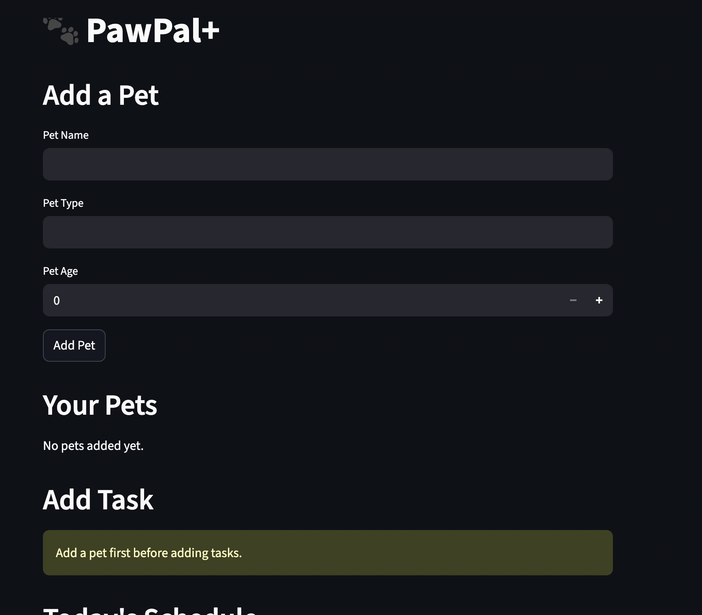
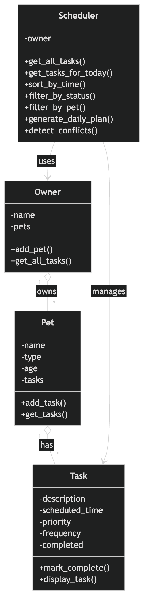

# PawPal+

PawPal+ is a local pet-care scheduling assistant built with Python and Streamlit. It combines a
rule-based scheduling system with local TF-IDF retrieval over a small, curated pet-care knowledge
base.



## What it can do

- Add pets and tasks, either through a form or by chatting with the assistant.
- Generate a schedule of tasks, filterable by Today / Upcoming / All, with dates and status shown.
- Detect scheduling conflicts (two tasks at the exact same time) and suggest the next open slot.
- Mark tasks complete; completing a `daily` or `weekly` task automatically creates its next
  occurrence.
- Answer general pet-care questions (feeding, grooming, exercise, vet visits) using retrieval over
  a small knowledge base, with a clear escalation message for anything that sounds urgent.

## How it works

The assistant combines rule-based commands with lightweight local TF-IDF retrieval. It does not
rely on an external LLM or API.

1. **Rule-based commands** — `ai_assistant.py` matches chat messages that *start with* a small,
   fixed set of command phrases (`add pet`, `add task`, `complete task`, `list pets`, `list
   tasks`, `help`) and parses their comma-separated arguments. Ordinary questions that merely
   mention one of these phrases are not affected, since matching is anchored to the start of the
   message.
2. **Local TF-IDF retrieval** — anything that isn't a command is checked against a small curated
   pet care knowledge base using scikit-learn's `TfidfVectorizer` and cosine similarity. The
   closest matching entry (or entries) is returned as-is. This is retrieval-based question
   answering, not retrieval-augmented generation — nothing is generated or synthesized, and no
   model call happens.

The scheduling engine (`pawpal_system.py`: `Owner`, `Pet`, `Task`, `Scheduler`) is plain Python —
dataclasses, sorting, and simple recurrence/conflict logic — used by both the Streamlit UI
(`app.py`) and the assistant (`ai_assistant.py`).



## Setup and run

Requires Python 3.9+.

```bash
git clone https://github.com/assemkdv/pawpal-plus.git
cd pawpal-plus
python -m venv .venv
source .venv/bin/activate        # Windows: .venv\Scripts\activate
pip install -r requirements.txt
streamlit run app.py
```

Then open http://localhost:8501. No API key or account is required — everything runs locally.

A small CLI demo of the scheduling engine (sorting, recurrence, conflict detection) is also
available, independent of Streamlit:

```bash
python main.py
```

## Example chat commands

```
add pet Buddy, dog, 3
add task Buddy, walk, 9, 0, 3, daily
complete task Buddy, walk
list pets
list tasks
help
```

Frequency must be one of `once`, `daily`, `weekly`. Pet names must be unique (case-insensitive).
You can also just ask a question, e.g. "How often should I groom my cat?"

## Project structure

```
pawpal-plus/
├── app.py                  # Streamlit UI
├── ai_assistant.py         # rule-based commands + local TF-IDF retrieval
├── pawpal_system.py        # scheduling engine (Owner, Pet, Task, Scheduler)
├── main.py                 # CLI demo of the scheduling engine
├── requirements.txt
├── tests/
│   ├── test_pawpal.py      # scheduling engine tests
│   └── test_assistant.py   # command parser and retrieval tests
├── docs/
│   └── reflection.md       # project reflection (coursework history)
└── assets/                 # README screenshots and diagram
```

## Testing

```bash
pytest
```

The suite covers scheduling correctness: sorting, recurring-task generation (including that
completing an already-completed task doesn't create duplicates), conflict detection, the
`find_next_available_slot` boundary case, input validation, and the chat parser and retrieval
behavior independent of Streamlit.

## Limitations

- **No persistence.** All pets and tasks live in memory for the current Streamlit session only —
  refreshing the browser clears everything.
- **Dogs and cats only.** The knowledge base doesn't cover other animals; PawPal+ says so rather
  than guessing.
- **Not veterinary advice.** Retrieval answers are general care information, not a diagnosis or
  treatment plan. For anything urgent (poisoning, seizures, difficulty breathing, bleeding, etc.)
  PawPal+ tells you to contact a veterinarian instead of attempting to help.
- **TF-IDF has no real language understanding.** Matching is keyword-based with light
  singular/plural normalization; unusual phrasing or typos can miss.
- **Single user, no auth.** There's no login and no separation between users.
